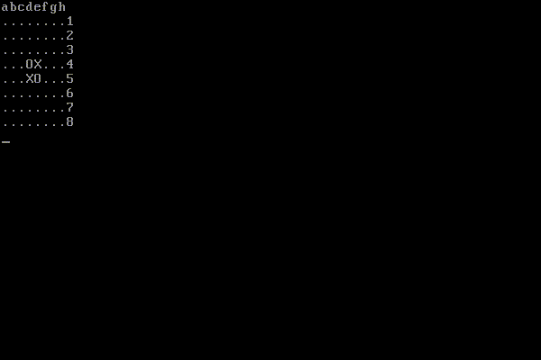

# boot_reversi

ブートセクタで動く512バイトのリバーシ（510バイト＋ブートシグネチャの2バイト）です。

[ブラウザ上のエミュレータでも動きます。](https://couyoh.github.io/boot_reversi/)



## ビルド

NASMが必要です。

```shell
make
```


## 起動

デバッグ用です。Bochsが必要です。

```shell
make debug
```

## 遊び方

石を置く座標を指定します。座標はx軸をa〜h、y軸を1〜8で指定します。例えば左上は`a1`、右下は`h8`です。
交互に先手と後手になり、どちらの場合もユーザが石を置く場所を入力します。

例を挙げましょう。初期画面は次のようになっています。

```
abcdefgh                                                                        
........1                                                                       
........2                                                                       
........3                                                                       
...OX...4                                                                       
...XO...5                                                                       
........6                                                                       
........7                                                                       
........8                                                                       
```

`O`が先手、`X`が後手ですので、はじめに先手が置く位置を指定します。

例えば`f4`と入力すると、X軸がf、y軸が4の位置に先手の`O`が置かれます。

```
abcdefgh                                                                        
........1                                                                       
........2                                                                       
........3                                                                       
...OOO..4                                                                       
...XO...5                                                                       
........6                                                                       
........7                                                                       
........8                                                                       
```

次に`f5`と押すと、X軸がf、y軸が5の位置に後手の`X`が置かれます。

```
abcdefgh                                                                        
........1                                                                       
........2                                                                       
........3                                                                       
...OOO..4                                                                       
...XXX..5                                                                       
........6                                                                       
........7                                                                       
........8                                                                       
```
